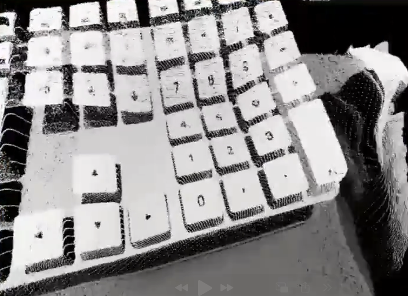

# Webcam Point Cloud Visualizer 🎥 ➡️ 🌐

An interactive 3D point cloud visualization using your webcam feed, built with Next.js, Three.js, and dat.GUI.



## Features ✨

- Real-time webcam to point cloud conversion
- Interactive 3D controls:
  - Manual rotation (mouse drag)
  - Auto-rotation with speed control
  - Rotation lock
  - Zoom (mouse wheel)
- Adjustable parameters:
  - Resolution (320x240 to 1280x720)
  - Point size and depth
  - Color intensity
  - RGB channel mixing
  - Rotation speed

## Technologies 🛠️

- [Next.js](https://nextjs.org/) - React framework
- [Three.js](https://threejs.org/) - 3D graphics library
- [dat.GUI](https://github.com/dataarts/dat.gui) - Parameter adjustment UI
- [TypeScript](https://www.typescriptlang.org/) - Type safety

## Prerequisites 📋

- Node.js 18.17 or later
- Modern web browser with WebGL support
- Webcam

## Setup 🚀

```bash
git clone https://github.com/harukaapps/3d-webcam-point-cloud.git
cd 3d-webcam-point-cloud
npm install
npm run dev
```

Then open [http://localhost:3000](http://localhost:3000)

## Implementation Details 📚

See [Technical Documentation](docs/TECHNICAL.md) for internal implementation details.

## License 📄

[MIT License](LICENSE) - Copyright (c) 2024 haruka_apps
